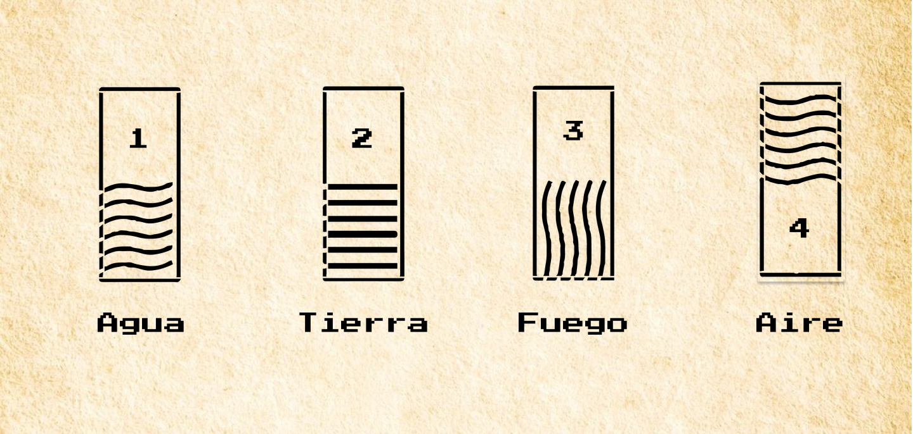
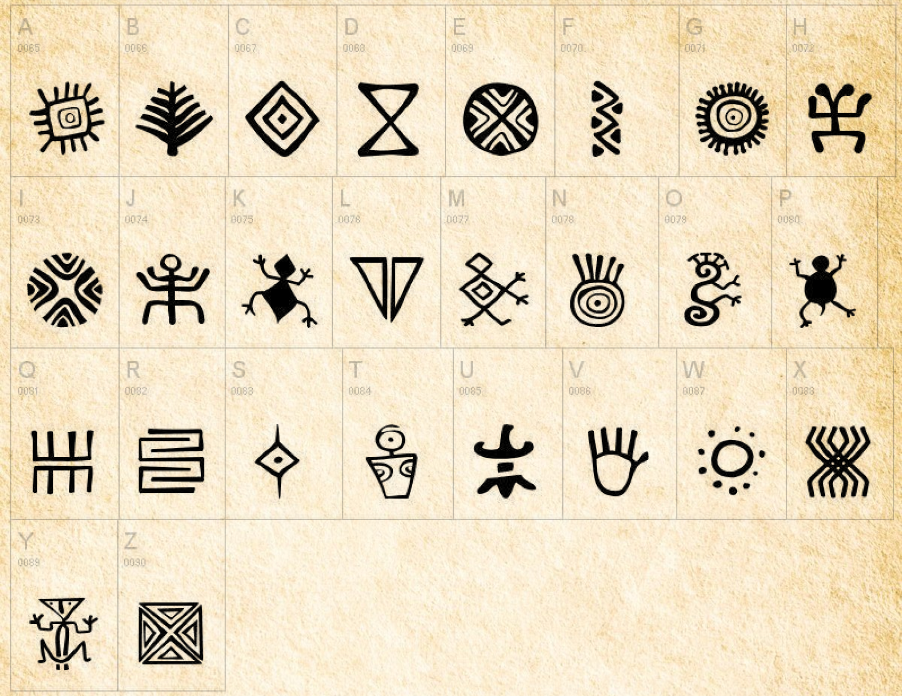

# 8 bits adventure

Imagina que te encuentras en un antiguo templo Quimbaya que ha sido descubierto recientemente. Serás capáz de encontrar el tesoro oculto dentro del templo antes de que se active una trampa mortal? 

## Quizá los siguientes elementos puedan ser de tu ayuda

## ¿Estás List@?

Para iniciar el reto solo debes ingresar al siguiente link:
- https://danieljara23.github.io/8bit-adventure/quimbaya/